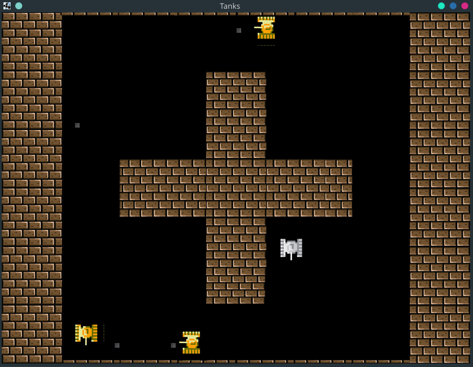

# Tanks-ala-8-bit

### This game it's not truly 8 bit. it only looks like 8bit becaucse was used images for sprites

## About this game

Simple 2D game. The player controls a tank and shoot projectiles to destroy enemy tanks around the playfield.

You can play single (with 3 bots) or with you one friend on one PC.

## System Requirements

- computer
- keyboard
- monitor
- Java 1.8 (not necessary fo windows version)

## Run compiled version:

Windows

- Run "Tanks_launcher.exe" or `java -jar Tanks.jar` in "compiled_game/windows/" folder

Linux:

- Switch to jvm-8 (for example `archlinux-java set java-8-openjdk`)
- Run `java -Djava.library.path=. -jar Tanks.jar` in "compiled_game/linux/" folder

## Controls

### menue

- mouse
- "esc" - pause

### first player

- "w", "a", "s", "d" - movement
- "c" - shooting

### second player

- "up", "down", "left", "right" - movement
- "/" - shooting

## Used technologies

- Java 1.8
- lwjgl 2.9.3 (open-source realization of OpenGl for Java)
- slick (2D Java Game Library) used only for loading images
- launch4j (Cross-platform Java executable wrapper)

## Documentation

[link to documentation (doc/Gr7_Proj_StepanenkoN_MatviichukD.pdf)](https://github.com/Despenrado/Tanks_java/blob/main/doc/Gr7_Proj_StepanenkoN_MatviichukD.pdf)

### This project was created together with [dmatviichuk](https://github.com/dmatviichuk)
